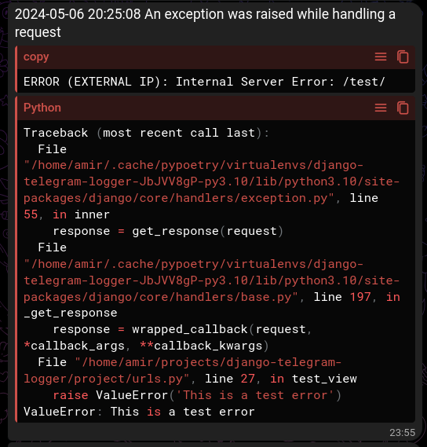

======================
django-telegram-sentry
======================

A simple django app to send your website's logs to multiple telegram chats

Configuration
=============

Follow these steps to configure django-telegram-sentry in your Django project:

1. Install the package using pip:
    
    .. code-block:: bash

        pip install django-telegram-sentry
    
2. Add ``django_telegram_sentry`` to your ``INSTALLED_APPS`` in ``settings.py``:
    
    .. code-block:: python

        INSTALLED_APPS = [ 
            ...,
            'django_telegram_sentry',
        ]

4. Include the ``django_telegram_sentry`` in your ``LOGGING`` settings in ``settings.py``:
    
    .. code-block:: python

        LOGGING = {
            'version': 1,
            'disable_existing_loggers': False,
            'handlers': {
                'telegram': {
                    'level': 'ERROR', # Use any level above DEBUG
                    'class': 'django_telegram_sentry.handler.TelegramHandler',
                    'token': 'your-telegram-bot-token',
                    'receiver_list': ['chat-id-1', 'chat-id-2', ...],
                    # Optionally use proxies as needed:
                    'proxies': {
                        'http': 'http://server_address:port',
                        'https': 'https://server_address:port'
                    }
                },
            },
            'root': {
                'handlers': ['telegram', 'other-handler', ...],
                'level': 'ERROR',
            },
        }

Exceptions that occur when calling Telegram's API will be stored in a file called ``telegram_errors.log``.

Result
======

After following these steps, your Django app will send logs to the specified Telegram chats. Here's an example of what you can expect:

